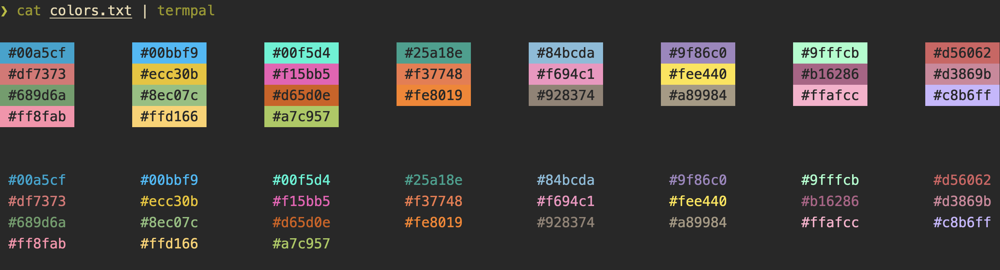

# termpal

✨ Overview
---

`termpal` *(short for terminal palette)* is a dead simple CLI tool that shows
you how colors will look in your terminal.



💾 Installation
---

**go**:

```sh
go install github.com/dhth/termpal@latest
```

⚡️ Usage
---

```bash
echo '#fb4934\n#83a598\n#d3869b' | termpal
# or
termpal -colors='#fb4934,#83a598,#d3869b'
# or
termpal -colors='#fb4934, #83a598, #d3869b'
```
